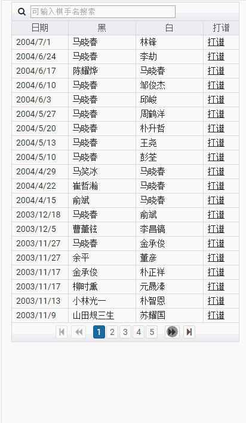
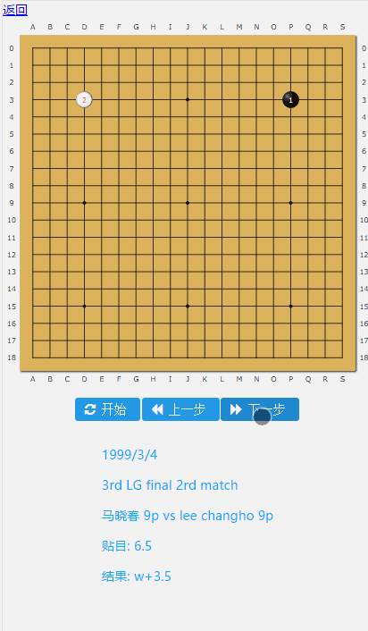

Kifugo is an online go game kifu respository and kifu player.
It is an **Angular2** app based on Nathan Walker's [angular-seed_advanced](https://github.com/NathanWalker/angular-seed-advanced).
The backend of this app is at [kifugo-backend](https://github.com/CG0323/kifugo-backend), which is **Node.js** + **Mongodb** Rest API.

# Demo
    


#### Integration with:
- [ngrx/store](https://github.com/ngrx/store) RxJS powered state management, inspired by **Redux**
- [ngrx/effects](https://github.com/ngrx/effects) Side effect model for @ngrx/store
- [ng2-translate](https://github.com/ocombe/ng2-translate) for i18n 
  - Usage is optional but on by default
  - Up to you and your team how you want to utilize it. It can be easily removed if not needed. 
- [angulartics2](https://github.com/angulartics/angulartics2) Vendor-agnostic analytics for Angular applications.
  - Out of box support for [Segment](https://segment.com/)
    - When using the seed, be sure to change your `write_key` [here](https://github.com/NathanWalker/angular-seed-advanced/blob/master/src/client/index.html#L24)
  - Can be changed to any vendor, [learn more here](https://github.com/angulartics/angulartics2#supported-providers)
- [lodash](https://lodash.com/) Helps reduce blocks of code down to single lines and enhances readability
- [NativeScript](https://www.nativescript.org/) cross platform mobile (w/ native UI) apps. [Setup instructions here](#nativescript-app).
- [Electron](http://electron.atom.io/) cross platform desktop apps (Mac, Windows and Linux). [Setup instructions here](#electron-app).

|  |
| :---: |
| *The zen of multiple platforms.* Chrome, Android and iPhone all running the same code. |

|  |
| :---: |
| *Programming Nirvana.* Mac and Windows desktop both running the same code. |

# Table of Contents

  
### Prerequisites

**Note** you should have **node v6.5.0 or higher** and **npm 3.10.3 or higher**.

## How to start

```bash
# install the project's dependencies
$ npm install
# fast install (via Yarn, https://yarnpkg.com)
$ yarn install  # or yarn
# watches your files and uses livereload by default
$ npm start

## License
MIT